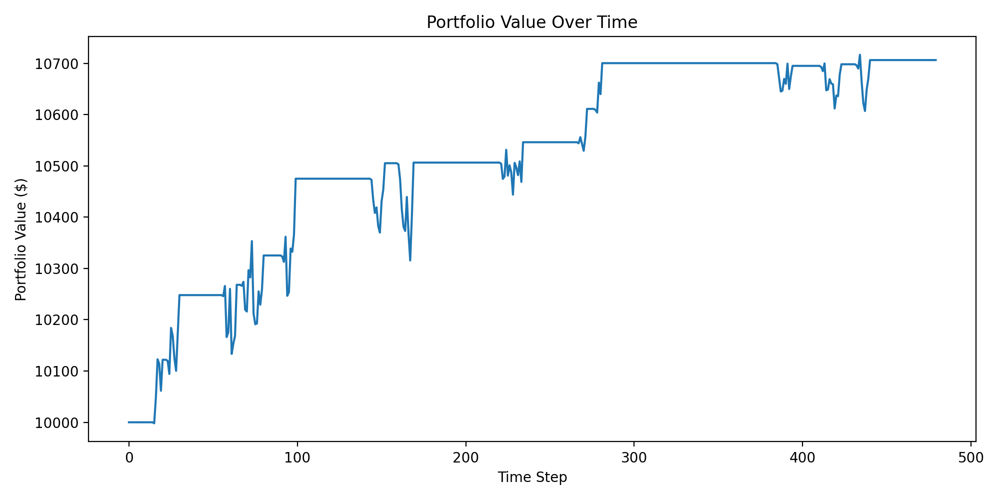

# Mean Reversion Trading Strategy (Z-Score Based)

## Overview
This project implements a mean reversion trading strategy using Z-scores on SPY price data. The strategy identifies short-term deviations from a rolling average and trades on the expectation that prices will revert to the mean.

The repository includes:
- A modular backtesting engine  
- Risk management and performance metrics  
- Live trading integration using Alpaca  
- Clean, extensible architecture for further strategy development  

---

## Strategy Logic

We compute the Z-score:

z = (price - moving average) / standard deviation

- Buy signal: z < -2.0 → price is significantly below mean  
- Sell signal: z ≥ -0.5 → partial mean reversion achieved  

---

## Parameters

| Parameter        | Value |
|----------------|------|
| Symbol          | SPY |
| Lookback Window | 20 periods |
| Entry Threshold | z < -1 |
| Exit Threshold  | z ≥ 0 |
| Position Size   | $300 |

---

## Backtest Results

Using historical SPY data:

cumulative_return: 0.0706  
sharpe_ratio: 1.0106  
max_drawdown: -0.0181  
volatility: 0.0362  
win_rate: 0.9231  
num_trades: 13  
Total portfolio value: $10706.23  

### Key Takeaways
- Positive return (~7%) over the test period  
- Sharpe ≈ 1.0 → solid risk-adjusted performance  
- Low max drawdown (~1.8%) → strong downside control  
- High win rate (92%) → consistent mean reversion behavior  

---

## Portfolio Performance

---

## Project Structure

- run_backtest.py → Runs full backtest  
- strategy.py → Mean reversion logic  
- backtest.py → Backtesting engine  
- risk.py → Position sizing + risk management  
- metrics.py → Performance evaluation  
- data.py → Data fetching (Yahoo Finance / Alpaca)  
- execution.py → Live trading execution layer  
- live_trading.py → Real-time trading script  

---

## How to Run

### 1. Install Dependencies
pip install -r requirements.txt

### 2. Run Backtest
python run_backtest.py

### 3. Run Live Trading (Paper Trading)
export APCA_API_KEY_ID=your_key  
export APCA_API_SECRET_KEY=your_secret  

python live_trading.py  

---

## Features

- Modular, production-style architecture  
- No lookahead bias in backtesting  
- Transaction costs + slippage modeling  
- Risk management (stop loss, drawdown limits)  
- Performance metrics (Sharpe, drawdown, volatility, win rate)  
- Alpaca live trading integration  

---

## Future Improvements

- Parameter optimization (grid search / Bayesian tuning)  
- Multi-asset / pairs trading extension  
- Short-selling support  
- Walk-forward testing  
- Deployment (AWS / Docker for live trading)  

---

## Author
Christopher Munroe  